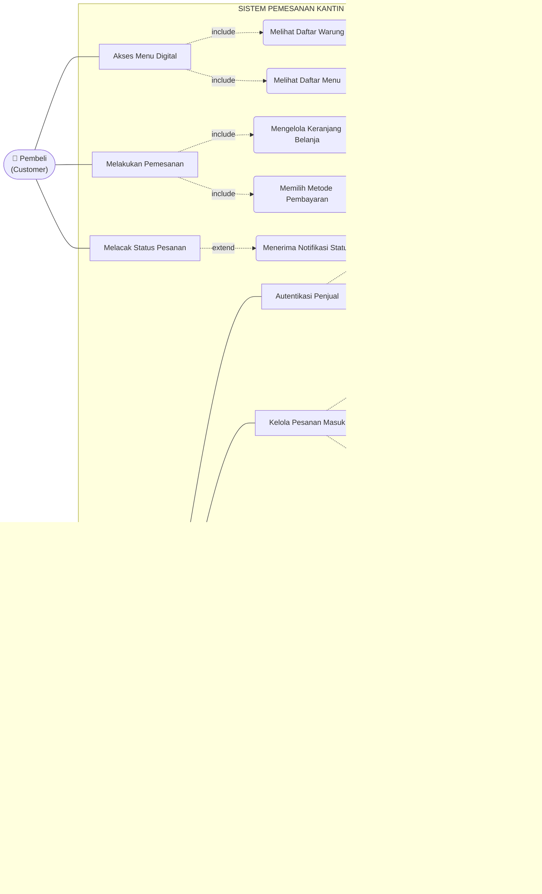
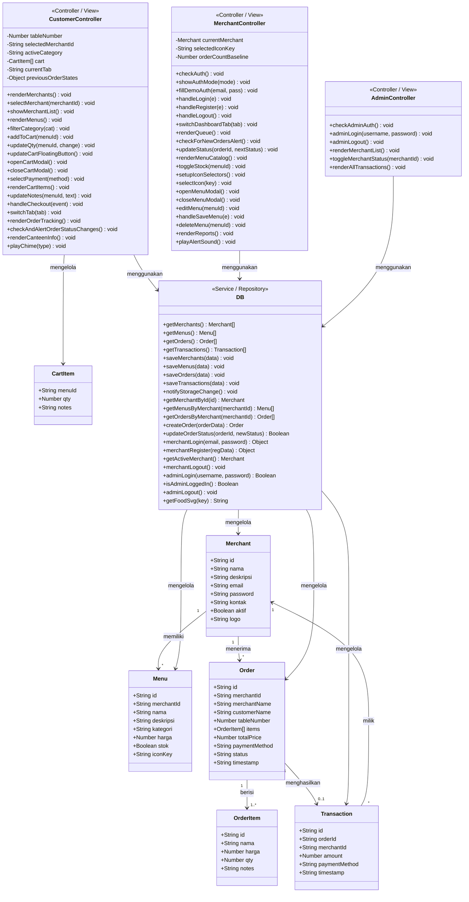
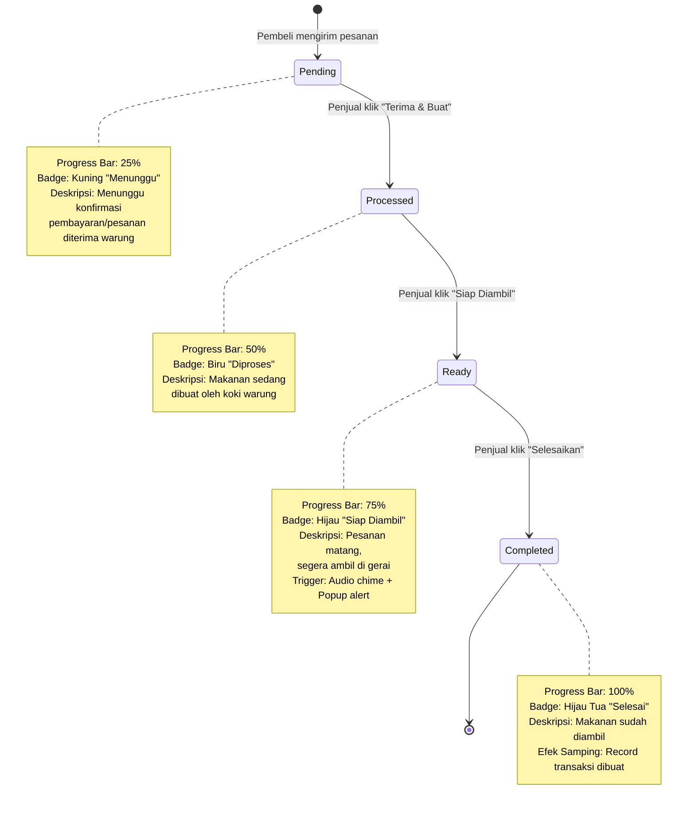

# DOKUMEN PERANCANGAN SISTEM UML
**(SISTEM PEMESANAN MAKANAN DAN MINUMAN BERBASIS DIGITALISASI (SCAN BARCODE) PADA KANTIN UNISLA)**

-----

## 1. PENDAHULUAN

### 1.1 Tujuan Dokumen
Dokumen ini merupakan dokumen perancangan sistem yang menjelaskan desain UML (Unified Modeling Language) dari Sistem Pemesanan Makanan dan Minuman Berbasis Digitalisasi (Scan Barcode) pada Kantin UNISLA. Dokumen ini mencakup Use Case Diagram, Daftar Use Case, Tabel Deskripsi Use Case, Main Flow, Alur Alternatif, dan Class Diagram.

### 1.2 Ruang Lingkup Sistem
Sistem ini dikembangkan berbasis web dengan menggunakan QR (Scan Barcode) untuk mengakses menu. Terdapat **3 (tiga) aktor utama** dalam sistem:

| No | Aktor | Peran |
|----|-------|-------|
| 1 | **Pembeli** (Customer) | Mahasiswa/civitas akademika yang memesan makanan melalui scan QR Code di meja kantin |
| 2 | **Penjual** (Merchant) | Pemilik warung/gerai di area kantin yang mengelola menu, menerima dan memproses pesanan |
| 3 | **Admin** | Pengelola kantin UNISLA yang mengawasi seluruh aktivitas penjual dan transaksi dalam sistem |

### 1.3 Teknologi yang Digunakan

| Komponen | Teknologi |
|----------|-----------|
| Frontend | HTML5, CSS3, Vanilla JavaScript |
| Database | LocalStorage (simulasi), siap migrasi ke MySQL/Firebase |
| Arsitektur | Client-Side SPA (Single Page Application) |
| Sinkronisasi | Cross-tab via Storage Event API |
| Font | Google Fonts (Inter, Outfit) |

-----

## 2. USE CASE DIAGRAM

### 2.1 Use Case Diagram Utama

-----

## 3. DAFTAR USE CASE

### 3.1 Daftar Use Case — Aktor Pembeli (Customer)

| No | ID Use Case | Nama Use Case | Prioritas |
|----|-------------|---------------|-----------|
| 1 | UC-01 | Scan QR Code / Input Nomor Meja | Tinggi |
| 2 | UC-02 | Melihat Daftar Warung | Tinggi |
| 3 | UC-03 | Melihat Daftar Menu | Tinggi |
| 4 | UC-04 | Filter Menu Berdasarkan Kategori | Sedang |
| 5 | UC-05 | Menambah Item ke Keranjang | Tinggi |
| 6 | UC-06 | Mengelola Keranjang Belanja | Tinggi |
| 7 | UC-07 | Melakukan Pemesanan / Checkout | Tinggi |
| 8 | UC-08 | Memilih Metode Pembayaran | Tinggi |
| 9 | UC-09 | Melacak Status Pesanan | Tinggi |
| 10 | UC-10 | Menerima Notifikasi Status Pesanan | Sedang |

### 3.2 Daftar Use Case — Aktor Penjual (Merchant)

| No | ID Use Case | Nama Use Case | Prioritas |
|----|-------------|---------------|-----------|
| 1 | UC-11 | Login Penjual | Tinggi |
| 2 | UC-12 | Registrasi Penjual Baru | Tinggi |
| 3 | UC-13 | Melihat Antrean Pesanan Real-time | Tinggi |
| 4 | UC-14 | Menerima & Memproses Pesanan | Tinggi |
| 5 | UC-15 | Mengubah Status Pesanan | Tinggi |
| 6 | UC-16 | Mengelola Menu (CRUD) | Tinggi |
| 7 | UC-17 | Toggle Ketersediaan Stok Menu | Tinggi |
| 8 | UC-18 | Melihat Laporan Penjualan | Sedang |
| 9 | UC-19 | Logout Penjual | Rendah |

### 3.3 Daftar Use Case — Aktor Admin (Pengelola Kantin)

| No | ID Use Case | Nama Use Case | Prioritas |
|----|-------------|---------------|-----------|
| 1 | UC-20 | Login Admin | Tinggi |
| 2 | UC-21 | Mengelola Data Penjual | Tinggi |
| 3 | UC-22 | Aktivasi / Nonaktivasi Akun Penjual | Tinggi |
| 4 | UC-23 | Melihat Riwayat Transaksi Seluruh Kantin | Sedang |
| 5 | UC-24 | Logout Admin | Rendah |

-----

## 4. TABEL DESKRIPSI USE CASE, MAIN FLOW, DAN ALUR ALTERNATIF

-----

### UC-01: Scan QR Code / Input Nomor Meja

| Komponen | Deskripsi |
|----------|-----------|
| **ID** | UC-01 |
| **Nama** | Scan QR Code / Input Nomor Meja |
| **Aktor** | Pembeli |
| **Deskripsi** | Pembeli mengakses sistem pemesanan dengan melakukan scan QR Code yang tersedia di meja kantin atau memasukkan nomor meja secara manual melalui halaman portal utama |
| **Pre-condition** | Pembeli memiliki perangkat smartphone/laptop dengan browser dan koneksi internet |
| **Post-condition** | Sistem menampilkan halaman pemesanan digital dengan nomor meja yang teridentifikasi |
| **Trigger** | Pembeli memindai QR Code di meja kantin atau mengklik tombol "Masuk Menu Digital" setelah memasukkan nomor meja |

#### Main Flow (Alur Utama)

| Langkah | Aktor | Sistem |
|---------|-------|--------|
| 1 | Pembeli memindai QR Code yang tersedia pada meja kantin menggunakan kamera smartphone | |
| 2 | | Sistem membuka halaman `customer.html` dengan parameter `tableNumber` pada URL |
| 3 | | Sistem membaca parameter `tableNumber` dari URL menggunakan `URLSearchParams` |
| 4 | | Sistem menampilkan badge nomor meja pada header (contoh: "📍 Meja Nomor: 52") |
| 5 | | Sistem menampilkan daftar warung/merchant yang aktif |

#### Alur Alternatif

| Kode | Kondisi | Aksi |
|------|---------|------|
| A1 | Pembeli tidak memindai QR Code | Pembeli membuka halaman portal utama (`index.html`), memasukkan nomor meja secara manual pada input field, lalu mengklik tombol "Masuk Menu Digital" |
| A2 | Nomor meja tidak diisi | Sistem menggunakan nomor meja default (52) |

-----

### UC-02: Melihat Daftar Warung

| Komponen | Deskripsi |
|----------|-----------|
| **ID** | UC-02 |
| **Nama** | Melihat Daftar Warung |
| **Aktor** | Pembeli |
| **Deskripsi** | Pembeli melihat daftar warung/gerai yang tersedia dan aktif beroperasi di kantin UNISLA |
| **Pre-condition** | Pembeli sudah membuka halaman pemesanan digital (UC-01 selesai) |
| **Post-condition** | Daftar warung aktif ditampilkan dalam bentuk kartu interaktif |
| **Trigger** | Sistem secara otomatis memanggil fungsi `renderMerchants()` saat halaman dimuat |

#### Main Flow (Alur Utama)

| Langkah | Aktor | Sistem |
|---------|-------|--------|
| 1 | | Sistem memanggil `DB.getMerchants()` untuk mengambil data seluruh merchant dari database |
| 2 | | Sistem memfilter merchant yang berstatus `aktif: true` |
| 3 | | Sistem merender kartu warung untuk setiap merchant aktif, menampilkan: icon SVG, nama warung, deskripsi singkat, badge status "BUKA" |
| 4 | Pembeli melihat daftar warung yang tersedia | |
| 5 | Pembeli mengklik salah satu kartu warung yang diinginkan | Sistem menyimpan `selectedMerchantId` dan menampilkan layar daftar menu warung tersebut |

#### Alur Alternatif

| Kode | Kondisi | Aksi |
|------|---------|------|
| A1 | Tidak ada warung yang aktif beroperasi | Sistem menampilkan pesan "Tidak ada warung aktif di kantin saat ini." |
| A2 | Warung dinonaktifkan oleh admin | Warung tersebut tidak muncul di daftar warung pembeli |

-----

### UC-03: Melihat Daftar Menu

| Komponen | Deskripsi |
|----------|-----------|
| **ID** | UC-03 |
| **Nama** | Melihat Daftar Menu |
| **Aktor** | Pembeli |
| **Deskripsi** | Pembeli melihat daftar menu makanan dan minuman yang ditawarkan oleh warung yang dipilih |
| **Pre-condition** | Pembeli sudah memilih warung (UC-02 selesai) |
| **Post-condition** | Daftar menu warung ditampilkan lengkap dengan nama, harga, deskripsi, icon, dan tombol aksi |
| **Trigger** | Pembeli mengklik kartu warung, sistem memanggil fungsi `renderMenus()` |

#### Main Flow (Alur Utama)

| Langkah | Aktor | Sistem |
|---------|-------|--------|
| 1 | | Sistem memanggil `DB.getMenusByMerchant(selectedMerchantId)` untuk mengambil semua menu milik warung terpilih |
| 2 | | Sistem menampilkan banner warung berisi nama dan deskripsi merchant |
| 3 | | Sistem menampilkan pill kategori filter: **Semua**, **Makanan**, **Minuman**, **Cemilan** |
| 4 | | Sistem merender setiap item menu berupa kartu dengan: icon SVG makanan, nama menu, deskripsi, harga dalam format Rupiah |
| 5 | | Untuk menu dengan stok tersedia (`stok: true`): sistem menampilkan tombol "Tambah" |
| 6 | | Untuk menu yang habis (`stok: false`): sistem menampilkan label "Habis" berwarna merah |
| 7 | Pembeli melihat dan memilih menu yang diinginkan | |

#### Alur Alternatif

| Kode | Kondisi | Aksi |
|------|---------|------|
| A1 | Warung belum memiliki menu | Daftar menu kosong, tidak ada item yang ditampilkan |
| A2 | Pembeli ingin kembali ke daftar warung | Pembeli menekan tombol "← Pilih Warung Lain", keranjang direset dan daftar warung ditampilkan kembali |

-----

### UC-04: Filter Menu Berdasarkan Kategori

| Komponen | Deskripsi |
|----------|-----------|
| **ID** | UC-04 |
| **Nama** | Filter Menu Berdasarkan Kategori |
| **Aktor** | Pembeli |
| **Deskripsi** | Pembeli memfilter tampilan daftar menu berdasarkan kategori tertentu untuk mempermudah pencarian |
| **Pre-condition** | Daftar menu warung sudah ditampilkan (UC-03 selesai) |
| **Post-condition** | Daftar menu hanya menampilkan item yang sesuai dengan kategori yang dipilih |
| **Trigger** | Pembeli mengklik salah satu pill kategori (Semua / Makanan / Minuman / Cemilan) |

#### Main Flow (Alur Utama)

| Langkah | Aktor | Sistem |
|---------|-------|--------|
| 1 | Pembeli mengklik pill kategori yang diinginkan (contoh: "Makanan") | |
| 2 | | Sistem memanggil fungsi `filterCategory(cat)` dan menyimpan kategori aktif ke variabel `activeCategory` |
| 3 | | Sistem menandai pill yang dipilih dengan class CSS `active` dan menghapus tanda aktif dari pill lainnya |
| 4 | | Sistem memfilter array menu berdasarkan field `kategori` yang sesuai dengan kategori terpilih |
| 5 | | Sistem merender ulang daftar menu yang sudah terfilter |

#### Alur Alternatif

| Kode | Kondisi | Aksi |
|------|---------|------|
| A1 | Pembeli memilih kategori "Semua" | Semua menu ditampilkan tanpa filter kategori |
| A2 | Kategori terpilih tidak memiliki item menu | Sistem menampilkan pesan "Tidak ada menu kategori ini." |

-----

### UC-05: Menambah Item ke Keranjang

| Komponen | Deskripsi |
|----------|-----------|
| **ID** | UC-05 |
| **Nama** | Menambah Item ke Keranjang |
| **Aktor** | Pembeli |
| **Deskripsi** | Pembeli menambahkan item menu makanan/minuman yang diinginkan ke dalam keranjang belanja |
| **Pre-condition** | Menu yang dipilih memiliki stok tersedia (`stok: true`) dan belum ada di keranjang |
| **Post-condition** | Item ditambahkan ke array keranjang (`cart`) dengan jumlah awal `qty: 1` |
| **Trigger** | Pembeli mengklik tombol "Tambah" pada kartu menu |

#### Main Flow (Alur Utama)

| Langkah | Aktor | Sistem |
|---------|-------|--------|
| 1 | Pembeli mengklik tombol "Tambah" pada menu yang diinginkan | |
| 2 | | Sistem memanggil fungsi `addToCart(menuId)` |
| 3 | | Sistem menambahkan objek `{ menuId, qty: 1, notes: '' }` ke dalam array `cart` |
| 4 | | Sistem memainkan efek suara "pop" melalui Web Audio API sebagai feedback interaksi |
| 5 | | Sistem memperbarui tombol floating cart: menampilkan jumlah item dan total harga |
| 6 | | Sistem merender ulang kartu menu — tombol "Tambah" berubah menjadi kontrol quantity (+/-) |

#### Alur Alternatif

| Kode | Kondisi | Aksi |
|------|---------|------|
| A1 | Item sudah ada di dalam keranjang | Tombol "Tambah" tidak ditampilkan, diganti dengan kontrol quantity (+/-) untuk mengubah jumlah |
| A2 | Menu habis (`stok: false`) | Tombol "Tambah" tidak ditampilkan, diganti label merah "Habis" dan kartu diberi style `out-of-stock` |

-----

### UC-06: Mengelola Keranjang Belanja

| Komponen | Deskripsi |
|----------|-----------|
| **ID** | UC-06 |
| **Nama** | Mengelola Keranjang Belanja |
| **Aktor** | Pembeli |
| **Deskripsi** | Pembeli mengubah jumlah item, menambahkan catatan khusus, atau menghapus item dari keranjang belanja sebelum melakukan checkout |
| **Pre-condition** | Keranjang memiliki minimal 1 item |
| **Post-condition** | Keranjang diperbarui sesuai perubahan yang dilakukan oleh pembeli |
| **Trigger** | Pembeli mengklik tombol floating cart "🛒 Keranjang" atau mengubah quantity melalui tombol +/- |

#### Main Flow (Alur Utama)

| Langkah | Aktor | Sistem |
|---------|-------|--------|
| 1 | Pembeli menekan tombol floating cart "🛒 Keranjang" | |
| 2 | | Sistem membuka modal keranjang dan memanggil `renderCartItems()` |
| 3 | | Sistem merender daftar item dalam keranjang: nama menu, harga × jumlah, kontrol quantity (+/-), dan field catatan |
| 4 | Pembeli mengubah jumlah item melalui tombol + (tambah) atau - (kurang) | |
| 5 | | Sistem memanggil `updateQty(menuId, change)` dan memperbarui `cart[idx].qty` |
| 6 | | Sistem memainkan efek suara "pop" dan merender ulang tampilan keranjang |
| 7 | Pembeli menambahkan catatan khusus pada field input (contoh: "tidak pedas", "tanpa es") | |
| 8 | | Sistem memanggil `updateNotes(menuId, text)` dan menyimpan catatan ke `cart[idx].notes` |
| 9 | | Sistem menampilkan dan memperbarui total harga pembayaran secara otomatis |

#### Alur Alternatif

| Kode | Kondisi | Aksi |
|------|---------|------|
| A1 | Jumlah item menjadi 0 (nol) setelah dikurangi | Item otomatis dihapus dari keranjang melalui `cart.splice(idx, 1)` |
| A2 | Keranjang kosong setelah semua item dihapus | Modal keranjang otomatis tertutup dan tombol floating cart disembunyikan |

-----

### UC-07: Melakukan Pemesanan / Checkout

| Komponen | Deskripsi |
|----------|-----------|
| **ID** | UC-07 |
| **Nama** | Melakukan Pemesanan / Checkout |
| **Aktor** | Pembeli |
| **Deskripsi** | Pembeli mengirimkan pesanan ke warung yang dipilih setelah mengisi data pemesan dan memilih metode pembayaran |
| **Pre-condition** | Keranjang tidak kosong, nama pemesan sudah diisi, metode pembayaran sudah dipilih |
| **Post-condition** | Pesanan tersimpan di database dengan status awal `pending`, pembeli diarahkan ke halaman pelacakan pesanan |
| **Trigger** | Pembeli mengklik tombol "Kirim Pesanan" pada form checkout |

#### Main Flow (Alur Utama)

| Langkah | Aktor | Sistem |
|---------|-------|--------|
| 1 | Pembeli mengisi nama pemesan pada field "Nama Pemesan" | |
| 2 | Pembeli memilih metode pembayaran: **Tunai (Cash)** atau **QRIS Unisla** | |
| 3 | Pembeli menekan tombol "Kirim Pesanan" | |
| 4 | | Sistem memanggil `handleCheckout(event)` dan memvalidasi nama pemesan tidak boleh kosong |
| 5 | | Sistem menyusun objek `orderItems` dari array `cart` yang berisi data menu (id, nama, harga, qty, notes) |
| 6 | | Sistem menghitung total harga pesanan |
| 7 | | Sistem memanggil `DB.createOrder()` yang membuat objek pesanan baru dengan: ID unik (format: `ord-{timestamp}-{random}`), status `pending`, timestamp pemesanan, data merchant, data customer, data item, total harga, metode pembayaran |
| 8 | | Sistem menyimpan order ID ke `localStorage['my_orders']` untuk keperluan pelacakan |
| 9 | | Sistem mereset keranjang belanja, menutup modal, mengosongkan field nama pemesan |
| 10 | | Sistem mengarahkan pembeli ke tab "Pesanan Saya" dan menampilkan notifikasi "Pesanan Anda berhasil dikirim ke warung!" |
| 11 | | Sistem mengirim data pesanan ke penjual melalui mekanisme sinkronisasi localStorage |

#### Alur Alternatif

| Kode | Kondisi | Aksi |
|------|---------|------|
| A1 | Nama pemesan tidak diisi (kosong) | Sistem menampilkan peringatan "Masukkan nama pemesan." dan menghentikan proses checkout |
| A2 | Metode pembayaran QRIS dipilih | Sistem menampilkan simulasi QR Code pembayaran QRIS sebelum tombol kirim pesanan |

-----

### UC-08: Memilih Metode Pembayaran

| Komponen | Deskripsi |
|----------|-----------|
| **ID** | UC-08 |
| **Nama** | Memilih Metode Pembayaran |
| **Aktor** | Pembeli |
| **Deskripsi** | Pembeli memilih metode pembayaran yang akan digunakan: pembayaran tunai (Cash) langsung ke kasir atau pembayaran digital melalui QRIS |
| **Pre-condition** | Modal keranjang/checkout sudah terbuka |
| **Post-condition** | Metode pembayaran tersimpan pada form dan siap diproses saat checkout |
| **Trigger** | Pembeli mengklik opsi radio button Cash atau QRIS pada form checkout |

#### Main Flow (Alur Utama)

| Langkah | Aktor | Sistem |
|---------|-------|--------|
| 1 | Pembeli mengklik radio button "Tunai / Cash" atau "QRIS Unisla" | |
| 2 | | Sistem memanggil `selectPayment(method)` |
| 3 | | Sistem meng-highlight border dan background label pembayaran yang dipilih menggunakan warna `var(--primary)` |
| 4 | | Jika metode **Cash** dipilih: label Cash di-highlight, tampilan QRIS disembunyikan |
| 5 | | Jika metode **QRIS** dipilih: label QRIS di-highlight, sistem menampilkan simulasi QR Code untuk pembayaran digital |

#### Alur Alternatif

| Kode | Kondisi | Aksi |
|------|---------|------|
| A1 | Tidak ada pilihan yang diubah | Metode pembayaran default adalah "Tunai / Cash" yang sudah terpilih secara otomatis saat modal dibuka |

-----

### UC-09: Melacak Status Pesanan

| Komponen | Deskripsi |
|----------|-----------|
| **ID** | UC-09 |
| **Nama** | Melacak Status Pesanan |
| **Aktor** | Pembeli |
| **Deskripsi** | Pembeli memantau progress pesanan secara real-time, mulai dari status menunggu hingga selesai |
| **Pre-condition** | Pembeli sudah pernah mengirim minimal 1 pesanan |
| **Post-condition** | Status pesanan terbaru ditampilkan dengan progress bar visual dan informasi detail |
| **Trigger** | Pembeli mengklik tab "Pesanan Saya" pada navigasi bawah (footer navigation) |

#### Main Flow (Alur Utama)

| Langkah | Aktor | Sistem |
|---------|-------|--------|
| 1 | Pembeli mengklik tab "Pesanan Saya" pada footer navigation | |
| 2 | | Sistem memanggil `switchTab('orders')` dan kemudian `renderOrderTracking()` |
| 3 | | Sistem membaca daftar order ID milik pembeli dari `localStorage['my_orders']` |
| 4 | | Sistem memfilter data pesanan dari `DB.getOrders()` berdasarkan daftar ID tersebut |
| 5 | | Sistem merender setiap pesanan dalam bentuk kartu yang menampilkan: nama warung, waktu pesanan, metode pembayaran, daftar item pesanan beserta catatan, total harga |
| 6 | | Sistem menampilkan status pesanan dengan badge berwarna dan progress bar visual: |
| | | — **Pending** (25%): badge kuning "Menunggu" — Menunggu konfirmasi/pembayaran |
| | | — **Processed** (50%): badge biru "Diproses" — Makanan sedang dibuat oleh koki |
| | | — **Ready** (75%): badge hijau "Siap Diambil" — Pesanan siap, ambil di gerai |
| | | — **Completed** (100%): badge hijau tua "Selesai" — Makanan sudah diambil |
| 7 | | Sistem secara otomatis mendeteksi perubahan status pesanan melalui event `storage` (cross-tab) dan `storage_updated` (same-tab) |

#### Alur Alternatif

| Kode | Kondisi | Aksi |
|------|---------|------|
| A1 | Pembeli belum pernah memesan | Sistem menampilkan pesan "Anda belum memiliki riwayat pesanan." beserta tombol "Pesan Sekarang" untuk menuju ke halaman pemesanan |
| A2 | Status pesanan berubah dari tab penjual | Sistem otomatis merender ulang tampilan tracking dengan data terbaru |

-----

### UC-10: Menerima Notifikasi Status Pesanan

| Komponen | Deskripsi |
|----------|-----------|
| **ID** | UC-10 |
| **Nama** | Menerima Notifikasi Status Pesanan |
| **Aktor** | Pembeli |
| **Deskripsi** | Pembeli menerima notifikasi otomatis ketika status pesanan berubah (diproses, siap diambil, atau selesai) |
| **Pre-condition** | Pembeli memiliki pesanan aktif yang belum selesai |
| **Post-condition** | Pembeli mendapat informasi perubahan status pesanan secara real-time |
| **Trigger** | Penjual mengubah status pesanan dari dashboard (cross-tab event) |

#### Main Flow (Alur Utama)

| Langkah | Aktor | Sistem |
|---------|-------|--------|
| 1 | | Sistem menjalankan fungsi `checkAndAlertOrderStatusChanges()` secara otomatis saat menerima event perubahan data |
| 2 | | Sistem membandingkan status pesanan saat ini dengan status sebelumnya yang tersimpan di `previousOrderStates` |
| 3 | | Jika status berubah menjadi **"processed"**: sistem memainkan chime audio dan menampilkan alert "Status Pesanan: Sekarang SEDANG DIPROSES." |
| 4 | | Jika status berubah menjadi **"ready"**: sistem memainkan chime audio dan menampilkan alert "🔔 SIAP DIAMBIL! Pesanan Anda sudah matang dan siap diambil." |
| 5 | | Jika status berubah menjadi **"completed"**: sistem memainkan chime audio dan menampilkan alert "Status Pesanan: SELESAI." |
| 6 | | Sistem memperbarui `previousOrderStates[id]` dengan status terbaru |

#### Alur Alternatif

| Kode | Kondisi | Aksi |
|------|---------|------|
| A1 | Tidak ada perubahan status | Fungsi tidak menampilkan notifikasi apapun |
| A2 | Pesanan baru pertama kali dimuat | Sistem menyimpan status awal sebagai baseline tanpa menampilkan notifikasi |

-----

### UC-11: Login Penjual

| Komponen | Deskripsi |
|----------|-----------|
| **ID** | UC-11 |
| **Nama** | Login Penjual |
| **Aktor** | Penjual |
| **Deskripsi** | Penjual masuk ke dashboard warung menggunakan email dan password yang terdaftar |
| **Pre-condition** | Penjual sudah memiliki akun yang terdaftar di sistem dan akun dalam status aktif |
| **Post-condition** | Session penjual tersimpan di localStorage, dashboard warung ditampilkan |
| **Trigger** | Penjual mengklik tombol "Login Dasbor" pada halaman merchant |

#### Main Flow (Alur Utama)

| Langkah | Aktor | Sistem |
|---------|-------|--------|
| 1 | Penjual membuka halaman `merchant.html` | Sistem menampilkan halaman login/registrasi |
| 2 | Penjual mengisi field email (contoh: busiti@unisla.ac.id) | |
| 3 | Penjual mengisi field password | |
| 4 | Penjual menekan tombol "Login Dasbor" | |
| 5 | | Sistem memanggil `DB.merchantLogin(email, password)` |
| 6 | | Sistem mencocokkan email (case-insensitive) dan password dengan data merchant yang terdaftar di database |
| 7 | | Jika ditemukan dan akun `aktif: true`: sistem menyimpan data merchant ke session localStorage (`ACTIVE_MERCHANT`) |
| 8 | | Sistem menyembunyikan form login dan menampilkan dashboard warung |
| 9 | | Sistem mengisi nama warung dan email di sidebar profil |
| 10 | | Sistem memuat antrean pesanan awal dan memulai sinkronisasi real-time |

#### Alur Alternatif

| Kode | Kondisi | Aksi |
|------|---------|------|
| A1 | Email atau password salah | Sistem menampilkan peringatan "Email atau password salah." |
| A2 | Akun penjual dinonaktifkan oleh admin | Sistem menampilkan peringatan "Akun Anda dinonaktifkan oleh Admin." dan login ditolak |
| A3 | Penjual menggunakan akun demo untuk uji coba | Penjual mengklik tombol demo (contoh: "Masuk sebagai Warung Bu Siti"), form otomatis terisi email dan password demo, lalu login berjalan otomatis |

-----

### UC-12: Registrasi Penjual Baru

| Komponen | Deskripsi |
|----------|-----------|
| **ID** | UC-12 |
| **Nama** | Registrasi Penjual Baru |
| **Aktor** | Penjual |
| **Deskripsi** | Penjual baru mendaftarkan warungnya ke dalam sistem kantin UNISLA |
| **Pre-condition** | Email penjual belum terdaftar di sistem |
| **Post-condition** | Data merchant baru tersimpan di database dengan status `aktif: true`, penjual otomatis masuk ke dashboard |
| **Trigger** | Penjual mengklik tombol "Daftar Sekarang" pada form registrasi |

#### Main Flow (Alur Utama)

| Langkah | Aktor | Sistem |
|---------|-------|--------|
| 1 | Penjual mengklik tab "Daftar Warung" pada halaman auth | Sistem menampilkan form registrasi |
| 2 | Penjual mengisi field: Nama Warung, Deskripsi Singkat, Email Warung, No. WhatsApp Aktif, Password Baru (minimal 6 karakter) | |
| 3 | Penjual menekan tombol "Daftar Sekarang" | |
| 4 | | Sistem memanggil `DB.merchantRegister(regData)` |
| 5 | | Sistem memeriksa duplikasi email (case-insensitive) terhadap data merchant yang sudah terdaftar |
| 6 | | Sistem membuat objek merchant baru: ID unik (`merchant-{timestamp}`), status `aktif: true`, icon default `snack` |
| 7 | | Sistem menyimpan data merchant baru ke array merchants di database |
| 8 | | Sistem otomatis menyimpan session login dan mengarahkan ke dashboard |

#### Alur Alternatif

| Kode | Kondisi | Aksi |
|------|---------|------|
| A1 | Email sudah terdaftar oleh penjual lain | Sistem menampilkan peringatan "Email sudah terdaftar." dan registrasi dibatalkan |
| A2 | Password kurang dari 6 karakter | Validasi HTML5 (`minlength="6"`) mencegah form disubmit |

-----

### UC-13: Melihat Antrean Pesanan Real-time

| Komponen | Deskripsi |
|----------|-----------|
| **ID** | UC-13 |
| **Nama** | Melihat Antrean Pesanan Real-time |
| **Aktor** | Penjual |
| **Deskripsi** | Penjual memantau pesanan yang masuk secara real-time dalam tampilan 3 kolom status (Pending, Diproses, Siap Diambil) |
| **Pre-condition** | Penjual sudah login ke dashboard (UC-11 selesai) |
| **Post-condition** | Seluruh antrean pesanan milik warung penjual ditampilkan dalam grid 3 kolom yang terorganisir |
| **Trigger** | Penjual membuka tab "Antrean Pesanan" atau terjadi perubahan data pesanan |

#### Main Flow (Alur Utama)

| Langkah | Aktor | Sistem |
|---------|-------|--------|
| 1 | Penjual mengklik menu "Antrean Pesanan" pada sidebar | |
| 2 | | Sistem memanggil `switchDashboardTab('queue')` dan kemudian `renderQueue()` |
| 3 | | Sistem memuat pesanan milik warung penjual melalui `DB.getOrdersByMerchant(merchantId)` |
| 4 | | Sistem merender pesanan ke dalam 3 kolom berdasarkan status: |
| | | — **Kolom 1: Pesanan Baru (Pending)** — kartu pesanan dengan tombol "Terima & Buat" |
| | | — **Kolom 2: Sedang Dibuat (Diproses)** — kartu pesanan dengan tombol "Siap Diambil" |
| | | — **Kolom 3: Siap Diambil** — kartu pesanan dengan tombol "Selesaikan" atau badge "Selesai" |
| 5 | | Setiap kartu pesanan menampilkan: ID pesanan, nomor meja, nama pelanggan, waktu, daftar item beserta catatan, total harga |
| 6 | | Sistem menampilkan counter jumlah pesanan pada header setiap kolom |
| 7 | | Sistem mendengarkan event `storage` dan `storage_updated` untuk pembaruan otomatis |

#### Alur Alternatif

| Kode | Kondisi | Aksi |
|------|---------|------|
| A1 | Tidak ada pesanan pada suatu kolom | Kolom menampilkan pesan informatif (contoh: "Tidak ada pesanan masuk.") |
| A2 | Pesanan baru masuk dari tab pembeli | Sistem mendeteksi perubahan via `checkForNewOrdersAlert()` dan memainkan chime alert "ding-dong" |

-----

### UC-14: Menerima & Memproses Pesanan

| Komponen | Deskripsi |
|----------|-----------|
| **ID** | UC-14 |
| **Nama** | Menerima & Memproses Pesanan |
| **Aktor** | Penjual |
| **Deskripsi** | Penjual menerima pesanan baru yang berstatus pending dan mulai memproses/membuat pesanan tersebut |
| **Pre-condition** | Terdapat minimal 1 pesanan berstatus `pending` di kolom "Pesanan Baru" |
| **Post-condition** | Status pesanan berubah menjadi `processed`, kartu pesanan berpindah ke kolom "Sedang Dibuat" |
| **Trigger** | Penjual mengklik tombol "Terima & Buat" pada kartu pesanan |

#### Main Flow (Alur Utama)

| Langkah | Aktor | Sistem |
|---------|-------|--------|
| 1 | Penjual melihat pesanan baru di kolom "Pesanan Baru (Pending)" | |
| 2 | Penjual memeriksa detail pesanan: item, jumlah, catatan pelanggan | |
| 3 | Penjual mengklik tombol "Terima & Buat" | |
| 4 | | Sistem memanggil `updateStatus(orderId, 'processed')` |
| 5 | | Sistem memanggil `DB.updateOrderStatus(orderId, 'processed')` yang memperbarui `orders[idx].status = 'processed'` |
| 6 | | Sistem menyimpan perubahan ke database dan men-trigger `notifyStorageChange()` |
| 7 | | Kartu pesanan berpindah dari kolom "Pending" ke kolom "Sedang Dibuat (Diproses)" |
| 8 | | Tab pembeli menerima event sinkronisasi dan menampilkan notifikasi bahwa pesanan sedang diproses |

#### Alur Alternatif

| Kode | Kondisi | Aksi |
|------|---------|------|
| A1 | Tidak ada pesanan pending | Kolom "Pesanan Baru" menampilkan pesan "Tidak ada pesanan masuk." |

-----

### UC-15: Mengubah Status Pesanan

| Komponen | Deskripsi |
|----------|-----------|
| **ID** | UC-15 |
| **Nama** | Mengubah Status Pesanan |
| **Aktor** | Penjual |
| **Deskripsi** | Penjual mengubah status pesanan secara bertahap sesuai alur pemrosesan: Diproses → Siap Diambil → Selesai |
| **Pre-condition** | Pesanan sudah berstatus `processed` atau `ready` |
| **Post-condition** | Status pesanan berubah ke tahap berikutnya, dan jika status menjadi `completed` maka record transaksi otomatis dibuat |
| **Trigger** | Penjual mengklik tombol status yang tersedia pada kartu pesanan |

#### Main Flow (Alur Utama)

| Langkah | Aktor | Sistem |
|---------|-------|--------|
| 1 | Penjual mengklik tombol "Siap Diambil" pada pesanan di kolom "Sedang Dibuat" | |
| 2 | | Sistem memanggil `DB.updateOrderStatus(orderId, 'ready')` dan mengubah status pesanan menjadi `ready` |
| 3 | | Kartu pesanan berpindah ke kolom "Siap Diambil", pembeli menerima notifikasi audio + alert |
| 4 | Penjual mengklik tombol "Selesaikan" pada pesanan di kolom "Siap Diambil" | |
| 5 | | Sistem mengubah status pesanan menjadi `completed` |
| 6 | | Sistem otomatis membuat record transaksi baru di `DB_KEYS.TRANSACTIONS` yang mencatat: ID transaksi, order ID, merchant ID, jumlah pembayaran, metode pembayaran, timestamp |
| 7 | | Tombol aksi pada kartu pesanan diganti dengan badge "Selesai" |

#### Alur Alternatif

| Kode | Kondisi | Aksi |
|------|---------|------|
| A1 | Pesanan sudah berstatus `completed` | Badge "Selesai" ditampilkan sebagai penanda, tidak ada tombol aksi yang tersedia |

-----

### UC-16: Mengelola Menu (CRUD)

| Komponen | Deskripsi |
|----------|-----------|
| **ID** | UC-16 |
| **Nama** | Mengelola Menu (CRUD: Create, Read, Update, Delete) |
| **Aktor** | Penjual |
| **Deskripsi** | Penjual mengelola katalog menu hidangan warungnya: menambah menu baru, mengubah data menu, dan menghapus menu |
| **Pre-condition** | Penjual sudah login ke dashboard (UC-11 selesai) |
| **Post-condition** | Perubahan data menu tersimpan di database dan tersinkronisasi ke halaman pembeli |
| **Trigger** | Penjual membuka tab "Kelola Menu" pada sidebar dashboard |

#### Main Flow (Alur Utama)

| Langkah | Aktor | Sistem |
|---------|-------|--------|
| 1 | Penjual mengklik menu "Kelola Menu" pada sidebar | |
| 2 | | Sistem memanggil `switchDashboardTab('menu')` dan `renderMenuCatalog()` |
| 3 | | Sistem menampilkan tabel katalog menu warung dengan kolom: Icon, Nama Menu, Kategori, Harga, Status Stok, Aksi |
| 4 | **[Tambah Menu Baru]** Penjual mengklik tombol "＋ Tambah Menu Baru" | Sistem membuka modal form kosong dengan judul "＋ Tambah Menu Baru" |
| 5 | Penjual mengisi: Nama Menu, Kategori (Makanan/Minuman/Cemilan), Harga (Rupiah), Deskripsi Singkat | |
| 6 | Penjual memilih icon/simbol gambar hidangan dari grid 8 pilihan SVG | Sistem meng-highlight icon yang dipilih dengan border dan background warna primary |
| 7 | Penjual menekan tombol "Simpan Menu" | Sistem menambahkan menu baru ke database dengan ID unik (`menu-{timestamp}`) dan stok default `true` |
| 8 | **[Edit Menu]** Penjual mengklik tombol "Edit" pada baris menu | Sistem membuka modal form dengan data menu yang sudah terisi otomatis |
| 9 | Penjual mengubah data yang diperlukan lalu menekan "Simpan Menu" | Sistem memperbarui data menu di database |
| 10 | **[Hapus Menu]** Penjual mengklik tombol "Hapus" pada baris menu | Sistem menampilkan dialog konfirmasi "Apakah Anda yakin ingin menghapus menu ini?" |
| 11 | Penjual mengkonfirmasi penghapusan | Sistem menghapus menu dari database dan merender ulang tabel |

#### Alur Alternatif

| Kode | Kondisi | Aksi |
|------|---------|------|
| A1 | Penjual belum memiliki menu | Tabel menampilkan pesan "Belum ada menu. Tambah menu pertama Anda!" |
| A2 | Penjual membatalkan penghapusan menu | Dialog konfirmasi ditutup, tidak ada perubahan data |
| A3 | Penjual menutup modal tanpa menyimpan | Modal tertutup, tidak ada perubahan data |

-----

### UC-17: Toggle Ketersediaan Stok Menu

| Komponen | Deskripsi |
|----------|-----------|
| **ID** | UC-17 |
| **Nama** | Toggle Ketersediaan Stok Menu |
| **Aktor** | Penjual |
| **Deskripsi** | Penjual mengubah status ketersediaan stok menu dari "Tersedia" menjadi "Habis" atau sebaliknya |
| **Pre-condition** | Penjual sudah login dan berada di halaman "Kelola Menu" |
| **Post-condition** | Status stok menu berubah (true ↔ false) dan perubahan tersinkronisasi ke halaman pembeli |
| **Trigger** | Penjual mengklik tombol status stok "Tersedia" atau "Habis" pada tabel menu |

#### Main Flow (Alur Utama)

| Langkah | Aktor | Sistem |
|---------|-------|--------|
| 1 | Penjual mengklik tombol status stok pada baris menu tertentu | |
| 2 | | Sistem memanggil `toggleStock(menuId)` |
| 3 | | Sistem membalik nilai `stok` pada menu yang dipilih: `true` → `false` (Habis) atau `false` → `true` (Tersedia) |
| 4 | | Sistem menyimpan perubahan ke database melalui `DB.saveMenus()` |
| 5 | | Sistem merender ulang tabel — tombol berubah: warna hijau "Tersedia" ↔ warna merah "Habis" |
| 6 | | Perubahan tersinkronisasi ke halaman pembeli: menu yang habis tidak bisa ditambahkan ke keranjang |

#### Alur Alternatif

| Kode | Kondisi | Aksi |
|------|---------|------|
| A1 | Menu sedang dipesan oleh pembeli | Status stok tetap bisa diubah, pesanan yang sudah masuk tetap diproses |

-----

### UC-18: Melihat Laporan Penjualan

| Komponen | Deskripsi |
|----------|-----------|
| **ID** | UC-18 |
| **Nama** | Melihat Laporan Penjualan |
| **Aktor** | Penjual |
| **Deskripsi** | Penjual melihat statistik penjualan dan riwayat transaksi warungnya |
| **Pre-condition** | Penjual sudah login ke dashboard (UC-11 selesai) |
| **Post-condition** | Widget statistik (total omset, jumlah transaksi, rata-rata penjualan) dan tabel riwayat transaksi ditampilkan |
| **Trigger** | Penjual mengklik menu "Laporan Penjualan" pada sidebar dashboard |

#### Main Flow (Alur Utama)

| Langkah | Aktor | Sistem |
|---------|-------|--------|
| 1 | Penjual mengklik menu "Laporan Penjualan" pada sidebar | |
| 2 | | Sistem memanggil `switchDashboardTab('reports')` dan `renderReports()` |
| 3 | | Sistem memuat data transaksi milik warung penjual dari `DB.getTransactions()` |
| 4 | | Sistem menghitung dan menampilkan 3 widget statistik: |
| | | — **💰 Total Omset**: jumlah total pendapatan dari seluruh transaksi selesai |
| | | — **📊 Transaksi Sukses**: jumlah total transaksi yang berhasil |
| | | — **📈 Rata-rata Penjualan**: rata-rata nilai per transaksi |
| 5 | | Sistem merender tabel riwayat transaksi yang diurutkan dari terbaru, berisi kolom: ID Transaksi, Waktu, Nomor Meja, Metode Bayar (badge), Total |

#### Alur Alternatif

| Kode | Kondisi | Aksi |
|------|---------|------|
| A1 | Belum ada transaksi yang tercatat | Widget menampilkan nilai Rp 0 dan 0; tabel menampilkan pesan "Belum ada riwayat transaksi finansial." |

-----

### UC-19: Logout Penjual

| Komponen | Deskripsi |
|----------|-----------|
| **ID** | UC-19 |
| **Nama** | Logout Penjual |
| **Aktor** | Penjual |
| **Deskripsi** | Penjual keluar dari sesi dashboard warung |
| **Pre-condition** | Penjual sudah login ke dashboard |
| **Post-condition** | Session penjual dihapus dari localStorage, form login ditampilkan kembali |
| **Trigger** | Penjual mengklik tombol "Keluar" pada sidebar dashboard |

#### Main Flow (Alur Utama)

| Langkah | Aktor | Sistem |
|---------|-------|--------|
| 1 | Penjual mengklik tombol "Keluar" pada bagian bawah sidebar | |
| 2 | | Sistem memanggil `handleLogout()` → `DB.merchantLogout()` |
| 3 | | Sistem menghapus key `ACTIVE_MERCHANT` dari localStorage |
| 4 | | Sistem memanggil `checkAuth()` yang menyembunyikan dashboard dan menampilkan kembali halaman login/registrasi |

#### Alur Alternatif

Tidak ada alur alternatif.

-----

### UC-20: Login Admin

| Komponen | Deskripsi |
|----------|-----------|
| **ID** | UC-20 |
| **Nama** | Login Admin |
| **Aktor** | Admin |
| **Deskripsi** | Admin masuk ke panel administrasi kantin UNISLA untuk mengelola penjual dan memantau transaksi |
| **Pre-condition** | Admin memiliki username dan password yang valid |
| **Post-condition** | Session admin tersimpan di localStorage, panel admin ditampilkan |
| **Trigger** | Admin mengklik tombol "Login" pada halaman admin |

#### Main Flow (Alur Utama)

| Langkah | Aktor | Sistem |
|---------|-------|--------|
| 1 | Admin membuka halaman `admin.html` | Sistem menampilkan form login admin |
| 2 | Admin mengisi field username | |
| 3 | Admin mengisi field password | |
| 4 | Admin menekan tombol login | |
| 5 | | Sistem memanggil `DB.adminLogin(username, password)` |
| 6 | | Sistem mencocokkan kredensial dengan data admin yang tersimpan (username: `admin`, password: `admin123`) |
| 7 | | Jika cocok: sistem menyimpan session admin ke localStorage (`DB_KEYS.ADMIN = 'true'`) |
| 8 | | Sistem menampilkan panel admin dengan fitur pengelolaan |

#### Alur Alternatif

| Kode | Kondisi | Aksi |
|------|---------|------|
| A1 | Username atau password salah | Login gagal, sistem menampilkan pesan error |

-----

### UC-21: Mengelola Data Penjual

| Komponen | Deskripsi |
|----------|-----------|
| **ID** | UC-21 |
| **Nama** | Mengelola Data Penjual |
| **Aktor** | Admin |
| **Deskripsi** | Admin melihat daftar seluruh penjual/warung yang terdaftar di sistem kantin |
| **Pre-condition** | Admin sudah login ke panel admin (UC-20 selesai) |
| **Post-condition** | Daftar seluruh penjual ditampilkan beserta informasi detail dan status aktif |
| **Trigger** | Admin membuka panel pengelolaan penjual |

#### Main Flow (Alur Utama)

| Langkah | Aktor | Sistem |
|---------|-------|--------|
| 1 | Admin membuka panel kelola penjual | |
| 2 | | Sistem memuat data seluruh merchant dari `DB.getMerchants()` |
| 3 | | Sistem menampilkan daftar/tabel seluruh penjual beserta informasi: nama warung, deskripsi, email, kontak, status aktif/nonaktif |
| 4 | Admin melihat dan meninjau data penjual | |

#### Alur Alternatif

| Kode | Kondisi | Aksi |
|------|---------|------|
| A1 | Belum ada penjual terdaftar | Daftar menampilkan pesan kosong |

-----

### UC-22: Aktivasi / Nonaktivasi Akun Penjual

| Komponen | Deskripsi |
|----------|-----------|
| **ID** | UC-22 |
| **Nama** | Aktivasi / Nonaktivasi Akun Penjual |
| **Aktor** | Admin |
| **Deskripsi** | Admin mengaktifkan atau menonaktifkan akun penjual/warung di sistem kantin |
| **Pre-condition** | Admin sudah login dan berada di halaman kelola penjual |
| **Post-condition** | Status aktif penjual berubah (aktif ↔ nonaktif) dan perubahan berdampak pada visibilitas warung di halaman pembeli |
| **Trigger** | Admin mengklik toggle atau tombol aktivasi/nonaktivasi pada data penjual |

#### Main Flow (Alur Utama)

| Langkah | Aktor | Sistem |
|---------|-------|--------|
| 1 | Admin mengklik tombol toggle aktif/nonaktif pada penjual tertentu | |
| 2 | | Sistem mengubah nilai `merchant.aktif` dari `true` → `false` (nonaktif) atau `false` → `true` (aktif) |
| 3 | | Sistem menyimpan perubahan ke database melalui `DB.saveMerchants()` |
| 4 | | Jika dinonaktifkan: warung penjual tidak muncul di daftar warung halaman pembeli |
| 5 | | Jika diaktifkan kembali: warung penjual kembali muncul di daftar warung halaman pembeli |

#### Alur Alternatif

| Kode | Kondisi | Aksi |
|------|---------|------|
| A1 | Penjual yang dinonaktifkan mencoba login | Sistem menampilkan pesan "Akun Anda dinonaktifkan oleh Admin." dan login ditolak |

-----

### UC-23: Melihat Riwayat Transaksi Seluruh Kantin

| Komponen | Deskripsi |
|----------|-----------|
| **ID** | UC-23 |
| **Nama** | Melihat Riwayat Transaksi Seluruh Kantin |
| **Aktor** | Admin |
| **Deskripsi** | Admin melihat seluruh riwayat transaksi dari semua warung/penjual di kantin UNISLA |
| **Pre-condition** | Admin sudah login ke panel admin |
| **Post-condition** | Tabel riwayat transaksi seluruh kantin ditampilkan |
| **Trigger** | Admin membuka panel riwayat transaksi |

#### Main Flow (Alur Utama)

| Langkah | Aktor | Sistem |
|---------|-------|--------|
| 1 | Admin membuka panel riwayat transaksi | |
| 2 | | Sistem memuat seluruh data transaksi dari `DB.getTransactions()` (tanpa filter per merchant) |
| 3 | | Sistem menampilkan tabel riwayat transaksi yang mencakup: ID Transaksi, Waktu, Nama Warung, Metode Pembayaran, Jumlah Total |
| 4 | Admin meninjau data transaksi untuk monitoring aktivitas kantin | |

#### Alur Alternatif

| Kode | Kondisi | Aksi |
|------|---------|------|
| A1 | Belum ada transaksi di seluruh kantin | Tabel menampilkan pesan kosong |

-----

### UC-24: Logout Admin

| Komponen | Deskripsi |
|----------|-----------|
| **ID** | UC-24 |
| **Nama** | Logout Admin |
| **Aktor** | Admin |
| **Deskripsi** | Admin keluar dari sesi panel administrasi kantin |
| **Pre-condition** | Admin sudah login ke panel admin |
| **Post-condition** | Session admin dihapus dari localStorage, form login admin ditampilkan kembali |
| **Trigger** | Admin mengklik tombol "Logout" pada panel admin |

#### Main Flow (Alur Utama)

| Langkah | Aktor | Sistem |
|---------|-------|--------|
| 1 | Admin mengklik tombol "Logout" | |
| 2 | | Sistem memanggil `DB.adminLogout()` |
| 3 | | Sistem menghapus key `DB_KEYS.ADMIN` dari localStorage |
| 4 | | Sistem menampilkan kembali halaman login admin |

#### Alur Alternatif

Tidak ada alur alternatif.

-----

## 5. CLASS DIAGRAM

-----

## 6. RELASI ANTAR ENTITAS

| No | Entitas Asal | Kardinalitas | Entitas Tujuan | Keterangan |
|----|-------------|:------------:|----------------|------------|
| 1 | Merchant | 1 → * | Menu | Satu merchant memiliki banyak menu makanan/minuman |
| 2 | Merchant | 1 → * | Order | Satu merchant menerima banyak pesanan dari pembeli |
| 3 | Order | 1 → 1..* | OrderItem | Satu pesanan berisi satu atau lebih item menu |
| 4 | Order | 1 → 0..1 | Transaction | Satu pesanan menghasilkan maksimal satu transaksi (hanya jika status = `completed`) |
| 5 | Transaction | * → 1 | Merchant | Banyak transaksi dimiliki oleh satu merchant |
| 6 | CustomerController | → | CartItem | Controller pembeli mengelola item-item keranjang belanja |

-----

## 7. STATE DIAGRAM — ALUR STATUS PESANAN

-----

## 8. STRUKTUR FILE PROYEK

| No | Nama File | Fungsi |
|----|-----------|--------|
| 1 | `index.html` | Halaman portal utama — gateway akses ke pembeli, penjual, dan admin |
| 2 | `customer.html` | Halaman pemesanan digital untuk pembeli (tampilan mobile-first) |
| 3 | `merchant.html` | Halaman dashboard penjual (login, kelola menu, antrean, laporan) |
| 4 | `admin.html` | Halaman panel admin (kelola penjual, monitoring transaksi) |
| 5 | `app.js` | Engine database dan logika bisnis utama (shared across all pages) |
| 6 | `styles.css` | Stylesheet global dengan design system premium (CSS variables, animations) |

-----

*Dokumen ini dibuat sebagai bagian dari Perancangan Sistem (System Design) dalam kerangka SDLC untuk Sistem Pemesanan Makanan dan Minuman Berbasis Digitalisasi (Scan Barcode) pada Kantin UNISLA.*
